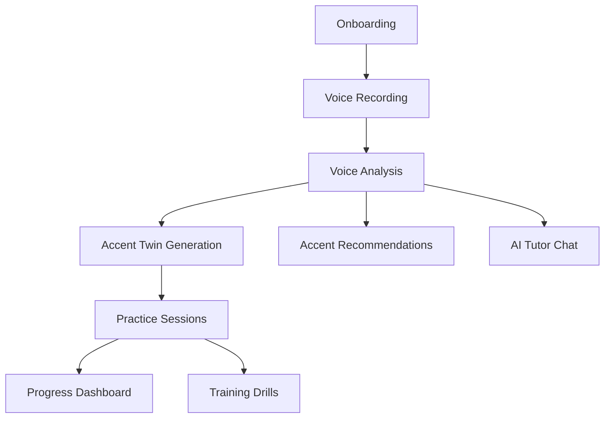

# iloqi Mobile App - Project Roadmap

> **Version:** 1.2
> **Last Updated:** 2025-10-01
> **Project:** Flutter Mobile Application for AI-Powered Accent Training

---

## 📋 Table of Contents

1. [Project Overview](#project-overview)
2. [Technology Stack](#technology-stack)
3. [Architecture Overview](#architecture-overview)
4. [Completed Work](#completed-work)
5. [Remaining Implementation](#remaining-implementation)
6. [Task Prioritization](#task-prioritization)
7. [Dependencies & Blockers](#dependencies--blockers)
8. [Timeline Estimates](#timeline-estimates)
9. [Resource Requirements](#resource-requirements)

---

## 1. Project Overview

### 1.1 Project Goals

**iloqi** is a revolutionary AI-powered accent training mobile application that helps users master English accents through:

- **Accent Twin Technology**: Generate synthetic versions of the user's voice speaking in perfect target accents
- **AI-Powered Analysis**: ML-based voice analysis using Whisper transcription and LibROSA audio features
- **Personalized Training**: Customized practice sessions based on user's accent profile and progress
- **Real-time Feedback**: Instant pronunciation guidance and improvement suggestions
- **Progress Tracking**: Comprehensive analytics and streak tracking

### 1.2 Target Accents

- 🇺🇸 **US** - American English (General American)
- 🇬🇧 **UK** - British English (Received Pronunciation)
- 🇦🇺 **AU** - Australian English
- 🇨🇦 **CA** - Canadian English
- 🇮🇪 **IE** - Irish English

### 1.3 Key Features

1. **Voice Recording & Analysis** - Upload and analyze voice samples with ML
2. **Accent Twin Generation** - Create synthetic voice in target accents (Edge TTS/ElevenLabs)
3. **Practice Sessions** - Guided training with listen-record-compare loops
4. **AI Tutor Chat** - Conversational AI guidance using GPT-4o
5. **Progress Dashboard** - Streaks, scores, and improvement trends
6. **Consent Management** - GDPR-compliant voice data handling

---

## 2. Technology Stack

### 2.1 Frontend (Flutter)

```yaml
Framework: Flutter 3.1.0+
Language: Dart
State Management: Riverpod 2.4.9
Navigation: GoRouter 12.1.3
UI: Material Design 3
```

### 2.2 Backend API

```yaml
Framework: Django REST Framework
API Version: 1.8.0
Authentication: JWT (access + refresh tokens)
Base URL: http://172.20.10.13:8000/api/
```

### 2.3 Key Dependencies

**Audio Processing:**
- `flutter_sound: ^9.2.13` - Audio recording
- `just_audio: ^0.9.36` - Audio playback
- `audioplayers: ^5.2.1` - Additional audio support

**Networking:**
- `dio: ^5.4.0` - HTTP client
- `retrofit: ^4.0.3` - Type-safe API client

**Storage:**
- `shared_preferences: ^2.2.2` - Local preferences
- `hive: ^2.2.3` - Local database
- `flutter_secure_storage: ^9.0.0` - Secure token storage

**UI Components:**
- `fl_chart: ^0.65.0` - Charts and analytics
- `lottie: ^2.7.0` - Animations
- `shimmer: ^3.0.0` - Loading states

---

## 3. Architecture Overview

### 3.1 Project Structure

```
lib/
├── core/
│   ├── app/                    # App initialization
│   ├── di/                     # Dependency injection
│   ├── models/                 # Shared data models
│   ├── providers/              # Global state providers
│   ├── routing/                # Navigation configuration
│   ├── services/               # API services
│   └── theme/                  # App theming
├── features/
│   ├── auth/                   # Authentication
│   ├── home/                   # Home dashboard
│   ├── voice/                  # Voice recording & analysis
│   ├── training/               # Practice sessions
│   ├── progress/               # Progress tracking
│   └── profile/                # User profile & settings
└── main.dart
```

### 3.2 API Integration Pattern

```
User Action → Provider → API Service (Retrofit) → Backend API
                ↓
         State Update → UI Rebuild
```

### 3.3 Authentication Flow

```
Login/Register → JWT Tokens → Secure Storage
                      ↓
              Auto-refresh on expiry
                      ↓
              Inject in API headers
```

---

## 4. Completed Work

### ✅ 4.1 Core Infrastructure (100%)

- [x] Flutter project setup with Material 3
- [x] Dependency injection container
- [x] GoRouter navigation with auth guards
- [x] Bottom navigation with 5 tabs
- [x] JWT authentication flow
- [x] Secure token storage
- [x] API service layer (Retrofit)
- [x] Error handling interceptors

### ✅ 4.2 Authentication Module (100%)

**Implemented Screens:**
- [x] Splash screen with auth check
- [x] Login page (email/password)
- [x] Registration page
- [x] Auth state management (Riverpod)

**API Endpoints Integrated:**
- [x] `POST /api/auth/login/` - User login
- [x] `POST /api/auth/register/` - User registration
- [x] `POST /api/auth/token/refresh/` - Token refresh
- [x] `GET /api/auth/profile/` - Get user profile
- [x] `PUT /api/auth/profile/update/` - Update profile

### ✅ 4.3 Home Dashboard (80%)

**Implemented:**
- [x] Home page layout
- [x] Quick action buttons
- [x] Progress overview cards
- [x] Recent activity list (static)
- [x] Navigation to other sections

**Pending:**
- [ ] Real API data integration
- [ ] Dynamic progress metrics
- [ ] Real-time activity feed

### ✅ 4.4 Voice Services (60%)

**API Service Layer:**
- [x] Voice sample upload endpoint
- [x] Voice analysis endpoint
- [x] Accent twin creation endpoint
- [x] Practice session endpoints
- [x] Progress tracking endpoints
- [x] TTS status endpoint

**Data Models:**
- [x] VoiceSample model
- [x] AccentTwin model
- [x] TrainingSession model
- [x] UserProgress model

### ✅ 4.5 Basic UI Pages (40%)

**Created (Skeleton):**
- [x] Voice analysis page
- [x] Accent twin page
- [x] Training page
- [x] Training session page
- [x] Progress page
- [x] Profile page

---

## 5. Remaining Implementation

### 🔴 Phase 1: Core Features (High Priority)

#### 5.1 Onboarding Flow (Completed)

**Screens to Implement:**
- [ ] Language selection (L1 language + region)
- [ ] Goal setting (learning objectives)
- [ ] Time commitment selection
- [ ] Microphone permission request
- [ ] Initial voice enrollment
- [ ] Spoken consent recording
- [ ] Twin generation status

**Wireframe Reference:** Screens 3-7 in wireframes.md

**API Integration:**
```dart
// Profile setup
PUT /api/auth/profile/update/
{
  "l1_language": "Spanish",
  "target_accent": "US",
  "preferred_session_duration": 10
}

// Consent recording
POST /api/samples/consent/record/
{
  "consent_type": "recording",
  "audio_file_path": "path/to/consent.wav"
}
```

**Estimated Effort:** 3-4 days

Implementation Plan (Sprint 1 - Onboarding)
- Create a single-stepper flow page to cover wireframes screens 3-7:
  - L1 & Goals
  - Mic Permission
  - Enrollment (Guided Recorder)
  - Spoken Consent
  - Twin Status
- File structure (initial consolidation to minimize file churn):
  - [features/onboarding/presentation/pages/onboarding_flow.dart](lib/features/onboarding/presentation/pages/onboarding_flow.dart)
- Routing:
  - Add route '/onboarding' in [app_router.dart](lib/core/routing/app_router.dart)
  - Redirect rule: if user is logged in but missing l1Language OR targetAccent OR no consent for accent_twin, redirect to '/onboarding' unless already there.
- State/Data:
  - Save L1, target accent, and preferred session duration via [AuthApiService.updateUser()](lib/core/services/auth_api_service.dart:27)
  - Reuse recording from the voice pipeline for Enrollment step via [voice_provider.dart](lib/core/providers/voice_provider.dart:21)
  - After consent recording, upload consent audio as a voice sample via [VoiceApiService.uploadVoiceSample()](lib/core/services/voice_api_service.dart:15) and record consent using new API methods
- API service updates (this cycle):
  - Add audio quality inspection endpoint:
    - POST /api/samples/audio/inspect/ → VoiceApiService.inspectAudioQuality(file)
  - Add consent endpoints:
    - POST /api/samples/consent/record/ → VoiceApiService.recordConsent(body)
    - GET /api/samples/consent/check/?consent_type=accent_twin → VoiceApiService.checkConsent(consentType, {voiceSampleId})
    - GET /api/samples/consent/history/ → VoiceApiService.getConsentHistory()
    - POST /api/samples/consent/{consent_id}/revoke/ → VoiceApiService.revokeConsent(consentId)
- UX specifics (aligned to wireframes.md):
  - L1 & Goals: dropdowns and segmented controls; Continue CTA
  - Permissions: request mic permission; show “Open Settings” if denied
  - Enrollment: reuse recorder UI (level meter, timer); validate 10–60s
  - Consent: show fixed sentence; record and upload; store consent
  - Twin Status: progress indicator and “Go to Home”
- Accessibility & i18n:
  - 44x44 tap targets, large text friendly, strings from constants for future localization
- Error handling:
  - Permission errors with actionable messaging
  - Network/API errors surfaced with retry CTAs

Acceptance Criteria
- Routing guard:
  - Given a logged-in user without l1Language or targetAccent or missing accent_twin consent, navigating anywhere redirects to '/onboarding'
  - Given a user with l1Language, targetAccent, and valid accent_twin consent, '/onboarding' is skipped and user can access '/home'
- L1 & Goals:
  - Selecting L1, region (optional), goal, and time per day then tapping Continue sends PUT /api/auth/profile/update/ and updates in-memory user state
- Mic Permission:
  - Tapping “Allow microphone” requests permission; if granted proceeds; if denied shows “Open Settings” which opens OS settings
- Enrollment Recorder:
  - User can record a voice sample (min 10s, max 60s enforced)
  - On stop, file path is available and a sample can be uploaded
- Consent (Spoken):
  - User records consent phrase; app uploads as a voice sample (multipart)
  - App calls POST /api/samples/consent/record/ with consent_type=accent_twin and voice_sample_id
  - Subsequent GET /api/samples/consent/check/?consent_type=accent_twin returns has_consent=true
- Twin Status:
  - Shows a processing indicator; “Go to Home” navigates to '/home'
- Tests:
  - Widget test: onboarding flow renders and navigates through L1→Permission→Enrollment→Consent→Status
  - Routing test: missing profile redirects to '/onboarding'; complete profile proceeds to '/home'
  - Service test (mocked): profile update and consent record requests are made with correct payloads

---

#### 5.2 Voice Recording & Analysis (Completed)

**To Implement:**

**A. Guided Voice Recorder Widget**
- [ ] Real-time audio level meter
- [ ] Noise detection indicator
- [ ] Clipping detection
- [ ] Duration validation (1-300 seconds)
- [ ] Quality feedback UI
- [ ] Re-record functionality

**B. Voice Analysis Flow**
- [ ] Upload voice sample with progress
- [ ] Trigger ML analysis
- [ ] Display analysis results:
  - Transcription with confidence
  - Detected accent
  - Overall quality score (0-100)
  - Pronunciation score
  - Fluency score
  - AI feedback and recommendations
  - Phoneme-level issues

**C. Audio Quality Inspector**
```dart
POST /api/samples/audio/inspect/
// Returns: SNR, clarity, volume consistency, artifacts
```

**Wireframe Reference:** Screens 5, 8-10 in wireframes.md

**Estimated Effort:** 5-6 days

---

#### 5.3 Accent Twin Generation (Partially Complete)

**To Implement:**

**A. Twin Preview Screen**
- [ ] Target accent selector (US/UK/AU/CA/IE)
- [ ] Mode toggle: Hi-Fi (twin) vs Generic
- [ ] Text input for custom phrases
- [ ] Quick phrase buttons (Ship-Sheep, Full-Fool, etc.)
- [ ] Preview button with loading state
- [ ] Audio player with waveform visualization
- [ ] A/B comparison toggle

**B. Twin Generation Flow**
```dart
// Create accent twin
POST /api/samples/accent-twins/
{
  "original_sample": 1,
  "target_accent": "US",
  "tts_provider": "edge_tts",
  "voice_model": "en-US-GuyNeural"
}

// Monitor status
GET /api/samples/accent-twins/{id}/status/
// Status: pending → processing → completed → failed

// Download result
GET /api/samples/accent-twins/{id}/
```

**C. Twin Comparison**
```dart
POST /api/samples/accent-twins/{id}/compare/
// Returns similarity scores and phoneme gaps
```

**Wireframe Reference:** Screen 8 in wireframes.md

**Estimated Effort:** 4-5 days

---

#### 5.4 Practice Sessions (Not Started)

**To Implement:**

**A. Practice Loop Screen**
- [ ] 3-step workflow: Listen → Record → Compare
- [ ] Step 1: Play target accent audio
- [ ] Step 2: Record user attempt with timer
- [ ] Step 3: A/B comparison player
- [ ] "Try Again" button
- [ ] "Get Feedback" button

**B. Instant Feedback Screen**
- [ ] Display 2-3 quick fixes
- [ ] Phoneme-specific tips with IPA
- [ ] Stress pattern corrections
- [ ] Suggested drill exercises
- [ ] "Save Session" button
- [ ] "Try Again" button

**C. Practice Session Management**
```dart
// Create practice session
POST /api/samples/voice-samples/{id}/practice-sessions/
{
  "target_accent": "US",
  "voice_gender": "female",
  "tts_provider": "edge_tts"
}

// Generate practice audio
POST /api/samples/practice-sessions/{id}/generate-audio/
{
  "text": "The quick brown fox..."
}

// Complete session
POST /api/samples/training-sessions/{id}/complete/
```

**Wireframe Reference:** Screens 9-10 in wireframes.md

**Estimated Effort:** 6-7 days

---

#### 5.5 Progress Dashboard (Partially Complete)

**To Implement:**

**A. Progress Overview**
- [ ] Weekly stats card (minutes, streak)
- [ ] Error rate trend chart
- [ ] Mastery by feature bars (ɪ vs iː, θ/ð, stress)
- [ ] "Start Next Drill" CTA

**B. Detailed Analytics**
```dart
// Get progress
GET /api/samples/progress/?target_accent=US
// Returns: total_samples, average_score, best_score,
//          current_streak, longest_streak, improvement_percentage

// Get accent statistics
GET /api/samples/statistics/accents/
// Returns: accent distribution, confidence levels, trends
```

**C. Charts & Visualizations**
- [ ] Weekly practice time chart (fl_chart)
- [ ] Score progression line chart
- [ ] Accent mastery radar chart
- [ ] Streak calendar heatmap

**Wireframe Reference:** Screen 11 in wireframes.md

**Estimated Effort:** 4-5 days

---

### 🟡 Phase 2: Enhanced Features (Medium Priority)

#### 5.6 AI Tutor Chat (Not Started)

**To Implement:**

**A. Chat Interface**
- [ ] Message list with user/tutor bubbles
- [ ] Text input field
- [ ] Voice input button (optional)
- [ ] Send button
- [ ] Typing indicator
- [ ] Message timestamps

**B. Chat Session Management**
```dart
// Create chat session
POST /api/samples/tutor-chat/sessions/create/
{
  "target_accent": "US",
  "voice_sample_id": 1
}

// Send message
POST /api/samples/tutor-chat/sessions/{id}/message/
{
  "message": "I keep saying /iː/ in 'live'"
}

// Get history
GET /api/samples/tutor-chat/sessions/{id}/?limit=20
```

**C. Context-Aware Responses**
- [ ] Include user's accent profile in context
- [ ] Reference recent practice sessions
- [ ] Provide actionable pronunciation tips
- [ ] Suggest relevant drills

**Wireframe Reference:** Screen 12 in wireframes.md

**Estimated Effort:** 5-6 days

---

#### 5.7 Training Drills System (Not Started)

**To Implement:**

**A. Drill Types**
- [ ] Minimal pairs (ship/sheep, full/fool)
- [ ] Stress patterns
- [ ] Vowel sounds (ɪ vs iː, æ vs ɑː)
- [ ] Consonant sounds (θ/ð, r/l)
- [ ] Intonation patterns

**B. Drill Session Flow**
```dart
// Get recommendations
GET /api/samples/recommendations/
// Returns: personalized drill suggestions

// Create training session
POST /api/samples/training-sessions/
{
  "name": "Minimal Pairs Practice",
  "exercise_type": "phonetic",
  "target_accent": "US"
}

// Track completion
POST /api/samples/training-sessions/{id}/complete/
```

**C. Drill UI Components**
- [ ] Exercise card with instructions
- [ ] Audio playback for examples
- [ ] Record button for practice
- [ ] Instant scoring
- [ ] Progress bar within drill

**Estimated Effort:** 6-7 days

---

#### 5.8 Accent Recommendations (Not Started)

**To Implement:**

**A. Recommendation Screen**
- [ ] Difficulty-sorted accent list
- [ ] Easy/Moderate/Challenging/Difficult badges
- [ ] Difficulty score (0-1)
- [ ] Reasoning for each accent
- [ ] Phonetic similarities list
- [ ] Phonetic challenges list
- [ ] Estimated learning time
- [ ] Success probability percentage

**B. API Integration**
```dart
GET /api/samples/voice-samples/{id}/accent-recommendations/
// Returns personalized recommendations based on user's L1
```

**C. Selection Flow**
- [ ] Tap accent to see details
- [ ] "Start Learning" button
- [ ] Update user profile with selected accent

**Estimated Effort:** 3-4 days

---

### 🟢 Phase 3: Polish & Optimization (Lower Priority)

#### 5.9 Settings & Profile (Partially Complete)

**To Implement:**

**A. Settings Sections**
- [ ] Account management (email, sign out)
- [ ] Voice & Privacy
  - [ ] Manage voice twin
  - [ ] Download consent audio
  - [ ] Delete voice data
- [ ] Learning preferences
  - [ ] Native language/region
  - [ ] Daily goal
  - [ ] Notification settings
- [ ] About & Safety
  - [ ] AI audio label
  - [ ] Usage policy
  - [ ] Terms of service

**B. Profile Management**
```dart
// Update profile
PUT /api/auth/profile/update/
{
  "l1_language": "Spanish",
  "target_accent": "UK",
  "preferred_session_duration": 15,
  "email_notifications": true
}

// Export data (GDPR)
GET /api/auth/export-data/

// Delete account
DELETE /api/auth/delete-account/
```

**Wireframe Reference:** Screen 13 in wireframes.md

**Estimated Effort:** 3-4 days

---

#### 5.10 Consent Management (Not Started)

**To Implement:**

**A. Consent Recording**
- [ ] Display consent text
- [ ] Record spoken consent
- [ ] Playback verification
- [ ] Save to backend

**B. Consent Management**
```dart
// Record consent
POST /api/samples/consent/record/
{
  "consent_type": "recording",
  "audio_file_path": "path/to/consent.wav"
}

// Check consent status
GET /api/samples/consent/check/?consent_type=recording

// Get consent history
GET /api/samples/consent/history/

// Revoke consent
POST /api/samples/consent/{id}/revoke/
```

**C. Consent UI**
- [ ] Consent status indicators
- [ ] Expiration warnings
- [ ] Renewal flow
- [ ] Audit trail display

**Wireframe Reference:** Screen 6 in wireframes.md

**Estimated Effort:** 3-4 days

---

#### 5.11 Offline Support (Not Started)

**To Implement:**

**A. Local Caching**
- [ ] Cache user profile
- [ ] Cache recent voice samples
- [ ] Cache training sessions
- [ ] Cache progress data
- [ ] Queue failed uploads

**B. Sync Strategy**
- [ ] Background sync when online
- [ ] Conflict resolution
- [ ] Retry logic for failed requests
- [ ] Offline mode indicator

**C. Hive Database Schema**
```dart
@HiveType(typeId: 0)
class CachedVoiceSample {
  @HiveField(0) int? id;
  @HiveField(1) String localPath;
  @HiveField(2) bool uploaded;
  @HiveField(3) DateTime createdAt;
}
```

**Estimated Effort:** 4-5 days

---

#### 5.12 Performance Optimization (Not Started)

**To Implement:**

**A. Audio Optimization**
- [ ] Compress audio before upload
- [ ] Stream large audio files
- [ ] Cache downloaded accent twins
- [ ] Preload next practice audio

**B. UI Performance**
- [ ] Lazy load lists
- [ ] Image caching (cached_network_image)
- [ ] Shimmer loading states
- [ ] Debounce search inputs

**C. Memory Management**
- [ ] Dispose audio players properly
- [ ] Clear audio cache periodically
- [ ] Monitor memory usage
- [ ] Profile with DevTools

**Estimated Effort:** 3-4 days

---

#### 5.13 Error Handling & UX (Not Started)

**To Implement:**

**A. Error States**
- [ ] Network error screens
- [ ] API error messages
- [ ] Validation errors
- [ ] Permission denied states
- [ ] Audio recording errors

**B. Loading States**
- [ ] Skeleton screens
- [ ] Progress indicators
- [ ] Upload progress bars
- [ ] Generation status updates

**C. Empty States**
- [ ] No voice samples yet
- [ ] No training sessions
- [ ] No progress data
- [ ] Onboarding prompts

**Estimated Effort:** 3-4 days

---

#### 5.14 Accessibility & i18n (Not Started)

**To Implement:**

**A. Accessibility**
- [ ] Screen reader support
- [ ] Minimum touch targets (44x44)
- [ ] High contrast mode
- [ ] Dynamic text sizing
- [ ] Audio captions

**B. Internationalization**
- [ ] String externalization
- [ ] English translations
- [ ] Spanish translations (optional)
- [ ] RTL support (future)
- [ ] Date/time formatting

**C. IPA Toggle**
- [ ] Show/hide IPA in settings
- [ ] IPA tooltips
- [ ] Phoneme explanations

**Estimated Effort:** 4-5 days

---

#### 5.15 Testing (Not Started)

**To Implement:**

**A. Unit Tests**
- [ ] Model serialization tests
- [ ] Provider logic tests
- [ ] Utility function tests
- [ ] Validation tests

**B. Widget Tests**
- [ ] Screen rendering tests
- [ ] User interaction tests
- [ ] Navigation tests
- [ ] Form validation tests

**C. Integration Tests**
- [ ] Auth flow tests
- [ ] Voice upload flow tests
- [ ] Practice session flow tests
- [ ] End-to-end scenarios

**Estimated Effort:** 5-6 days

---

## 6. Task Prioritization

### 🔴 Critical Path (MVP Blockers)

These tasks must be completed for a functional MVP:

1. **Onboarding Flow** (3-4 days)
   - Blocks: User acquisition, first-time experience
   - Dependencies: None
   - Priority: **HIGHEST**

2. **Voice Recording & Analysis** (5-6 days)
   - Blocks: All voice-related features
   - Dependencies: Onboarding
   - Priority: **HIGHEST**

3. **Accent Twin Generation** (4-5 days)
   - Blocks: Core value proposition
   - Dependencies: Voice analysis
   - Priority: **HIGHEST**

4. **Practice Sessions** (6-7 days)
   - Blocks: Training functionality
   - Dependencies: Accent twins
   - Priority: **HIGH**

5. **Progress Dashboard** (4-5 days)
   - Blocks: User retention
   - Dependencies: Practice sessions
   - Priority: **HIGH**

**Total Critical Path: ~23-27 days**

---

### 🟡 High Priority (Post-MVP)

6. **AI Tutor Chat** (5-6 days)
   - Enhances: User engagement
   - Dependencies: Voice analysis
   - Priority: **MEDIUM-HIGH**

7. **Training Drills System** (6-7 days)
   - Enhances: Practice variety
   - Dependencies: Practice sessions
   - Priority: **MEDIUM-HIGH**

8. **Accent Recommendations** (3-4 days)
   - Enhances: Personalization
   - Dependencies: Voice analysis
   - Priority: **MEDIUM**

---

### 🟢 Medium Priority (Enhancements)

9. **Settings & Profile** (3-4 days)
10. **Consent Management** (3-4 days)
11. **Offline Support** (4-5 days)
12. **Performance Optimization** (3-4 days)
13. **Error Handling & UX** (3-4 days)

---

### ⚪ Low Priority (Nice-to-Have)

14. **Accessibility & i18n** (4-5 days)
15. **Testing** (5-6 days)

---

## 7. Dependencies & Blockers

### 7.1 Technical Dependencies



### 7.2 External Dependencies

**Backend API:**
- ✅ All required endpoints are implemented (v1.8.0)
- ✅ TTS system is production-ready (100% success rate)
- ✅ Authentication system is complete
- ⚠️ Need to verify API base URL for production

**Third-Party Services:**
- ✅ Edge TTS (free, active)
- 🔄 ElevenLabs (premium, ready but not required for MVP)
- ✅ OpenAI GPT-4o (for AI tutor)

**Platform Permissions:**
- ⚠️ Microphone permission (iOS/Android)
- ⚠️ Storage permission (Android)
- ⚠️ Notification permission (optional)

### 7.3 Known Blockers

1. **Login Implementation Note:**
   - User mentioned: "about the login, we could just leave the screens for login with google but not necessary make a real implementation as the login is already working"
   - ✅ Email/password login is complete
   - 🔄 Google/Apple sign-in can be UI-only placeholders for MVP

2. **Audio Recording Stability:**
   - Using `flutter_sound: ^9.2.13` (more stable)
   - Need to test on both iOS and Android
   - May need platform-specific adjustments

3. **File Upload Size:**
   - API limit: 50MB
   - Need to implement client-side compression
   - Consider chunked uploads for large files

---

## 8. Timeline Estimates

### 8.1 Sprint Planning (2-week sprints)

#### **Sprint 1: Foundation & Onboarding** (Days 1-10)
- [ ] Onboarding flow (3-4 days)
- [ ] Voice recording widget (3-4 days)
- [ ] Audio quality validation (2-3 days)

**Deliverable:** Users can complete onboarding and record voice samples

---

#### **Sprint 2: Voice Analysis & Twins** (Days 11-20)
- [ ] Voice analysis integration (3-4 days)
- [ ] Analysis results UI (2-3 days)
- [ ] Accent twin generation (4-5 days)

**Deliverable:** Users can analyze voice and generate accent twins

---

#### **Sprint 3: Practice & Training** (Days 21-30)
- [ ] Practice session flow (4-5 days)
- [ ] Instant feedback UI (2-3 days)
- [ ] Training session management (3-4 days)

**Deliverable:** Users can practice with accent twins and get feedback

---

#### **Sprint 4: Progress & Polish** (Days 31-40)
- [ ] Progress dashboard (4-5 days)
- [ ] Charts and analytics (2-3 days)
- [ ] Error handling & UX (3-4 days)

**Deliverable:** MVP ready for beta testing

---

#### **Sprint 5: Enhanced Features** (Days 41-50)
- [ ] AI Tutor chat (5-6 days)
- [ ] Accent recommendations (3-4 days)

**Deliverable:** Enhanced user engagement features

---

#### **Sprint 6: Optimization & Testing** (Days 51-60)
- [ ] Training drills system (6-7 days)
- [ ] Performance optimization (3-4 days)

**Deliverable:** Production-ready app

---

### 8.2 Milestone Timeline

| Milestone | Target Date | Status |
|-----------|-------------|--------|
| **M1: MVP Core** | Week 4 | 🔴 Not Started |
| - Onboarding complete | Week 1 | 🔴 Not Started |
| - Voice analysis working | Week 2 | 🔴 Not Started |
| - Accent twins functional | Week 3 | 🔴 Not Started |
| - Practice sessions live | Week 4 | 🔴 Not Started |
| **M2: Beta Release** | Week 6 | 🔴 Not Started |
| - Progress tracking | Week 5 | 🔴 Not Started |
| - Error handling | Week 5 | 🔴 Not Started |
| - Beta testing | Week 6 | 🔴 Not Started |
| **M3: Enhanced Features** | Week 8 | 🔴 Not Started |
| - AI Tutor | Week 7 | 🔴 Not Started |
| - Training drills | Week 8 | 🔴 Not Started |
| **M4: Production** | Week 10 | 🔴 Not Started |
| - Optimization | Week 9 | 🔴 Not Started |
| - Testing & QA | Week 10 | 🔴 Not Started |

---

### 8.3 Realistic Timeline

**Assuming 1 full-time developer:**

- **MVP (Critical Path):** 4-5 weeks
- **Beta Release:** 6-7 weeks
- **Production Ready:** 10-12 weeks

**With 2 developers (parallel work):**

- **MVP:** 3-4 weeks
- **Beta Release:** 5-6 weeks
- **Production Ready:** 7-9 weeks

---

## 9. Resource Requirements

### 9.1 Team Roles

**Required:**
- ✅ **Flutter Developer** (1-2) - Mobile app development
- ✅ **Backend Developer** (0) - API is complete
- ⚠️ **UI/UX Designer** (0.5) - Wireframes exist, need visual design
- ⚠️ **QA Engineer** (0.5) - Testing and quality assurance

**Optional:**
- **DevOps Engineer** (0.25) - CI/CD and deployment
- **Product Manager** (0.25) - Feature prioritization

### 9.2 Third-Party Services

**Required:**
- ✅ Backend API (already deployed)
- ✅ Edge TTS (free, no setup needed)
- ✅ OpenAI API (for AI tutor)

**Optional:**
- 🔄 ElevenLabs (premium voice cloning)
- 🔄 Firebase (analytics, crashlytics)
- 🔄 App Store / Play Store accounts

### 9.3 Infrastructure

**Development:**
- ✅ Flutter SDK 3.1.0+
- ✅ Android Studio / VS Code
- ✅ iOS Simulator / Android Emulator
- ⚠️ Physical devices for testing

**Deployment:**
- 🔄 Apple Developer Account ($99/year)
- 🔄 Google Play Developer Account ($25 one-time)
- 🔄 CI/CD pipeline (GitHub Actions / Codemagic)

### 9.4 Budget Estimates

**Development Costs:**
- Flutter Developer (1): $5,000-8,000/month × 3 months = $15,000-24,000
- UI/UX Designer (0.5): $3,000-5,000/month × 2 months = $6,000-10,000
- QA Engineer (0.5): $2,500-4,000/month × 2 months = $5,000-8,000

**Service Costs:**
- Apple Developer: $99/year
- Google Play: $25 one-time
- OpenAI API: ~$50-200/month (usage-based)
- ElevenLabs (optional): $99-330/month

**Total Estimated Budget: $26,000-42,000**

---

## 10. Risk Assessment

### 10.1 Technical Risks

| Risk | Impact | Probability | Mitigation |
|------|--------|-------------|------------|
| Audio recording issues on iOS | High | Medium | Use flutter_sound, test early |
| Large file uploads failing | Medium | Medium | Implement compression & chunking |
| TTS generation delays | Medium | Low | Show progress, allow background |
| API rate limiting | High | Low | Implement caching & retry logic |
| Memory leaks from audio | Medium | Medium | Proper disposal, profiling |

### 10.2 Product Risks

| Risk | Impact | Probability | Mitigation |
|------|--------|-------------|------------|
| Poor user retention | High | Medium | Focus on onboarding & quick wins |
| Complex UX confusing users | High | Medium | User testing, simplify flows |
| Slow accent twin generation | Medium | Low | Set expectations, show progress |
| Privacy concerns | High | Low | Clear consent, GDPR compliance |

### 10.3 Timeline Risks

| Risk | Impact | Probability | Mitigation |
|------|--------|-------------|------------|
| Scope creep | High | High | Strict MVP definition, backlog |
| Underestimated complexity | Medium | Medium | Buffer time, agile sprints |
| Platform-specific bugs | Medium | High | Early testing on both platforms |
| Third-party API changes | Low | Low | Version pinning, monitoring |

---

## 11. Success Metrics

### 11.1 MVP Success Criteria

**Technical:**
- [ ] 95%+ crash-free rate
- [ ] <3s app launch time
- [ ] <5s voice upload time (for 30s audio)
- [ ] <2s accent twin generation (Edge TTS)

**User Experience:**
- [ ] <5 min onboarding completion
- [ ] >80% onboarding completion rate
- [ ] >60% users complete first practice session
- [ ] >40% users return next day

**Feature Adoption:**
- [ ] 100% users record voice sample
- [ ] >70% users generate accent twin
- [ ] >50% users complete 3+ practice sessions
- [ ] >30% users use AI tutor

### 11.2 Post-Launch Metrics

**Engagement:**
- Daily Active Users (DAU)
- Weekly Active Users (WAU)
- Average session duration
- Practice streak retention

**Learning Outcomes:**
- Average pronunciation improvement
- Accent consistency scores
- User-reported confidence gains

**Business:**
- User acquisition cost
- Retention rate (D1, D7, D30)
- Premium conversion rate (if applicable)

---

## 12. Next Steps

### 12.1 Immediate Actions

1. **Review & Approve Roadmap**
   - Stakeholder review
   - Priority adjustments
   - Timeline confirmation

2. **Setup Development Environment**
   - Configure API base URL
   - Test API connectivity
   - Setup error tracking

3. **Design System**
   - Create Material 3 theme
   - Define color palette
   - Create reusable components

4. **Start Sprint 1**
   - Begin onboarding flow
   - Setup audio recording
   - Implement quality checks

### 12.2 Questions to Resolve

1. **Google/Apple Sign-In:**
   - Keep as UI placeholders only? ✅ (per user note)
   - Or implement OAuth flows?

2. **API Base URL:**
   - Current: `http://172.20.10.13:8000/api/`
   - Production URL needed?

3. **Premium Features:**
   - ElevenLabs voice cloning?
   - Subscription model?
   - Free tier limitations?

4. **Analytics:**
   - Firebase Analytics?
   - Custom analytics?
   - Privacy considerations?

---

## 13. Appendix

### 13.1 API Endpoint Summary

**Authentication:**
- `POST /api/auth/register/` - Register user
- `POST /api/auth/login/` - Login user
- `POST /api/auth/token/refresh/` - Refresh token
- `GET /api/auth/profile/` - Get profile
- `PUT /api/auth/profile/update/` - Update profile

**Voice Samples:**
- `POST /api/samples/voice-samples/` - Upload sample
- `POST /api/samples/voice-samples/{id}/analyze/` - Analyze
- `GET /api/samples/voice-samples/{id}/results/` - Get results
- `POST /api/samples/audio/inspect/` - Quality check

**Accent Twins:**
- `POST /api/samples/accent-twins/` - Create twin
- `GET /api/samples/accent-twins/{id}/status/` - Check status
- `GET /api/samples/accent-twins/{id}/` - Get twin
- `POST /api/samples/accent-twins/{id}/compare/` - Compare

**Practice:**
- `POST /api/samples/voice-samples/{id}/practice-sessions/` - Create session
- `POST /api/samples/practice-sessions/{id}/generate-audio/` - Generate audio
- `POST /api/samples/training-sessions/{id}/complete/` - Complete session

**Progress:**
- `GET /api/samples/progress/` - Get progress
- `GET /api/samples/statistics/accents/` - Get stats
- `GET /api/samples/recommendations/` - Get recommendations

**AI Tutor:**
- `POST /api/samples/tutor-chat/sessions/create/` - Create chat
- `POST /api/samples/tutor-chat/sessions/{id}/message/` - Send message
- `GET /api/samples/tutor-chat/sessions/{id}/` - Get history

**Consent:**
- `POST /api/samples/consent/record/` - Record consent
- `GET /api/samples/consent/check/` - Check consent
- `GET /api/samples/consent/history/` - Get history

### 13.2 Wireframe Screen Mapping

| Screen # | Name | Status | Priority |
|----------|------|--------|----------|
| 1 | Launch/Auth Gate | ✅ Complete | - |
| 2 | Sign In | ✅ Complete | - |
| 3 | Onboarding (L1 & Goals) | 🔴 Not Started | High |
| 4 | Permissions (Mic) | 🔴 Not Started | High |
| 5 | Enrollment (Recorder) | 🔴 Not Started | High |
| 6 | Consent (Spoken) | 🔴 Not Started | Medium |
| 7 | Twin Status | 🔴 Not Started | High |
| 8 | Preview (Twin) | 🟡 Partial | High |
| 9 | Practice (Loop) | 🔴 Not Started | High |
| 10 | Feedback (Instant) | 🔴 Not Started | High |
| 11 | Progress | 🟡 Partial | High |
| 12 | Tutor (Chat) | 🔴 Not Started | Medium |
| 13 | Settings | 🟡 Partial | Medium |

### 13.3 Key Design Tokens

```dart
// Colors
const primaryColor = Color(0xFF6750A4);
const secondaryColor = Color(0xFF7BDAA0);
const errorColor = Color(0xFFB3261E);

// Spacing
const spacing8 = 8.0;
const spacing12 = 12.0;
const spacing16 = 16.0;

// Corner Radius
const borderRadius = 16.0;

// Typography
const titleLarge = TextStyle(fontSize: 22, fontWeight: FontWeight.w600);
const bodyMedium = TextStyle(fontSize: 14, fontWeight: FontWeight.w400);
const labelSmall = TextStyle(fontSize: 11, fontWeight: FontWeight.w500);
```

---

## Changelog

- 2025-10-01 v1.2: Enhanced Voice Recording & Analysis with detailed results display, AI feedback, and phoneme-level issues. Integrated voice analysis into onboarding flow with automatic progression. Enhanced ResultsStep with comprehensive analysis display including confidence scores, audio quality metrics, pronunciation scores, AI feedback, and phoneme issues.
  - Affected files:
    - [lib/features/voice/presentation/pages/voice_analysis_page.dart](lib/features/voice/presentation/pages/voice_analysis_page.dart)
    - [lib/features/voice/presentation/widgets/results_step.dart](lib/features/voice/presentation/widgets/results_step.dart)
    - [lib/features/onboarding/presentation/pages/onboarding_flow.dart](lib/features/onboarding/presentation/pages/onboarding_flow.dart)
  - Features: Real-time audio level meters, duration validation (10-60s), quality inspection, comprehensive analysis results, AI feedback display, phoneme-level issue reporting, seamless onboarding integration.

- 2025-10-01 v1.1: Implemented onboarding flow scaffolding (L1 & Goals, Mic Permission, Enrollment Recorder, Consent, Status). Added consent and audio inspect endpoints to VoiceApiService; added OnboardingFlowPage and router redirect guards; updated Splash logic; roadmap updated with plan and acceptance criteria.
  - Affected files:
    - [lib/core/services/voice_api_service.dart](lib/core/services/voice_api_service.dart)
    - [lib/core/services/voice_api_service.g.dart](lib/core/services/voice_api_service.g.dart)
    - [lib/core/routing/app_router.dart](lib/core/routing/app_router.dart)
    - [lib/features/auth/presentation/pages/splash_page.dart](lib/features/auth/presentation/pages/splash_page.dart)
    - [lib/features/onboarding/presentation/pages/onboarding_flow.dart](lib/features/onboarding/presentation/pages/onboarding_flow.dart)
  - Follow-ups: add widget/service tests; wire API consent verification in splash redirect; polish UI per wireframes tokens.

---

## 📝 Document History

| Version | Date | Author | Changes |
|---------|------|--------|---------|
| 1.0 | 2025-10-01 | Kilo Code | Initial roadmap creation |

---

**End of Roadmap**