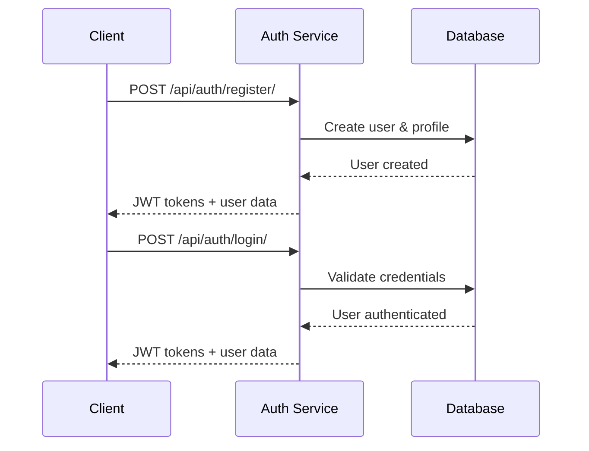
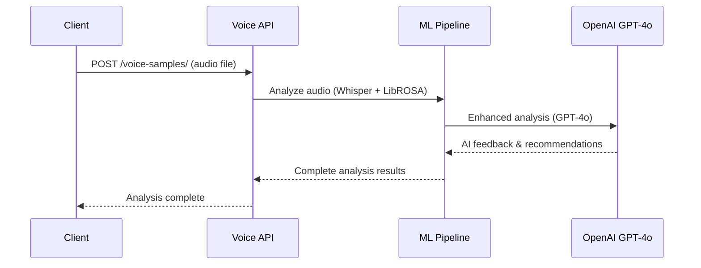

# iloqi – Flutter Mobile Wireframes (V1)

> Endpoint‑free, screen‑by‑screen wireframes for the MVP app. ASCII layouts, nav map, and key UI states. Optimized for Flutter (Material 3 + custom tokens).

---

## 0) App Map / Navigation
```
[Launch]
  → (AuthGate) → [Sign in / Sign up]
                       ↓
                 [Onboarding]
                       ↓
                 [Permissions]
                       ↓
                 [Enrollment]
                       ↓
                 [Consent]
                       ↓
                 [Twin Status]
                       ↓
   ┌────────────────────────────────────┐
   │              Home                  │
   │  Tabs:  Preview | Practice | Progress | Tutor | Settings  │
   └────────────────────────────────────┘
```

---

## 1) Launch / Auth Gate
```
+--------------------------------------+
| iloqi                                |
|  (logo)                              |
|--------------------------------------|
|  [  Continue with Apple   ]          |
|  [  Continue with Google  ]          |
|  [  Sign in with email    ]          |
|--------------------------------------|
|  New here?  [ Create account ]       |
+--------------------------------------+
```

## 2) Sign in (Email)
```
+--------------------------------------+
|  Email: [_____________]              |
|  Password: [__________] (eye)        |
|  ( ) Remember me                     |
|                                      |
|  [  Sign in  ]      [ Forgot? ]      |
+--------------------------------------+
```

## 3) Onboarding – L1 & Goals
```
+--------------------------------------+
| Your native language                 |
| [ Spanish (LatAm)  v ]               |
| Region (optional)                    |
| [ Colombia v ]                       |
|--------------------------------------|
| Goal                                 |
| [ Be clearer at work  v ]            |
| Time per day                         |
| [ 10 min v ]                         |
|--------------------------------------|
| Quick wins for Spanish speakers      |
| [ ɪ vs iː ] [ θ/ð ] [ stress ]       |
|                                      |
|                 [ Continue ]         |
+--------------------------------------+
```

## 4) Permissions (Mic)
```
+--------------------------------------+
| We need your microphone              |
| To analyze your pronunciation.       |
|                                      |
| [ Allow microphone ]                 |
| [ Open Settings ] (if denied)        |
+--------------------------------------+
```

## 5) Enrollment – Guided Recorder
```
+--------------------------------------+
| Read naturally:                      |
| “I live in Sydney…”                  |
| -----------------------------------  |
| ● REC   00:22                        |
| Level  [■■■■■□□]  Noise [■□□]        |
| Clipping [ No ]   Length [ OK ]      |
|                                      |
| [ Re-record ]        [ Continue ]    |
+--------------------------------------+
```

## 6) Consent (Spoken)
```
+--------------------------------------+
| Say this sentence to give consent:   |
| “I consent to iloqi creating a       |
|  personal synthetic voice of me.”    |
|                                      |
| ● REC 00:05   [ Re-record ]  [ Save ]|
+--------------------------------------+
```

## 7) Twin Status
```
+--------------------------------------+
| Creating your voice twin…            |
| ⟳ Processing (you can keep using app)|
| [ Go to Home ]                       |
+--------------------------------------+
```

---

# Home Tabs

## 8) Preview (Twin)
```
+--------------------------------------+
| Target accent: [ AU v ]   Mode: (•) Hi‑Fi ( ) Generic |
| Text                               ▼ |
| [ Type or pick a phrase…           ] |
| [ Ship–Sheep ] [ Full–Fool ] [ Stress ] |
|                                      |
|                [ ▶︎ Preview ]         |
|--------------------------------------|
| Player                               |
| Twin  [ ▶︎ | ■ | ◼︎ ]  waveform ~~~~  |
|                                      |
+--------------------------------------+
```

## 9) Practice (Loop)
```
+--------------------------------------+
| Listen → Record → Compare            |
| 1) Listen  [ ▶︎ ]                    |
| 2) Record  ● 00:03  [ Stop ]         |
| 3) Compare [ A/B toggle ]            |
|                                      |
| [ Try again ]   [ Get Feedback ]     |
+--------------------------------------+
```

## 10) Feedback (Instant)
```
+--------------------------------------+
| 2 quick fixes                        |
| • /ɪ/ → too close to /iː/ in “live”  |
|   Tip: keep it short & relaxed.      |
| • Stress first syllable in “Sydney”. |
|--------------------------------------|
| Suggested drill (0:40)               |
| [ ▶︎ Minimal pairs: ship/sheep ]     |
|                                      |
| [ Save session ]  [ Try again ]      |
+--------------------------------------+
```

## 11) Progress
```
+--------------------------------------+
| This week                            |
| Minutes: 34   Streak: 4 days         |
| Error rate ↓ 18% vs last week        |
|--------------------------------------|
| Mastery by feature                   |
| ɪ vs iː   ■■■■□□                     |
| θ/ð       ■■■□□□                     |
| Stress    ■■■■□□                     |
|--------------------------------------|
| [ Start next drill ]                 |
+--------------------------------------+
```

## 12) Tutor (Chat)
```
+--------------------------------------+
| Tutor                                |
| You: I keep saying /iː/ in “live”.   |
| Tutor: Try this 10s drill…           |
|                                      |
| [ Mic ]  [ Type a message ]  [ ▶︎ ]  |
+--------------------------------------+
```

## 13) Settings
```
+--------------------------------------+
| Account                              |
|  • Email, Sign out                   |
| Voice & Privacy                      |
|  • Manage voice twin  • Download consent |
|  • Delete voice                      |
| Learning                             |
|  • Native language / Region          |
|  • Daily goal                        |
| About & Safety                       |
|  • AI audio label, usage policy      |
+--------------------------------------+
```

---

# Components & Patterns (Flutter‑friendly)
- **App bars**: LargeTitle on first tab screen, standard on depth screens.
- **Bottom nav**: 5 tabs (Preview, Practice, Progress, Tutor, Settings).
- **Primary CTAs**: filled buttons; secondary = tonal; tertiary = text buttons.
- **Record control**: floating circular button (FAB‑like) with timer.
- **Meters**: simple horizontal bars for Level/Noise; red flag on clipping.
- **Player**: shared widget with A/B compare and scrubber.

## Design Tokens (suggested)
- Color primary: `#6750A4`; secondary: `#7BDAA0`; error: `#B3261E`.
- Surface variants for dark mode; 8/12/16 spacing scale; corner radius `16`.
- Typography: TitleLarge, BodyMedium, LabelSmall for meters.

## Accessibility & i18n
- Minimum touch target 44x44; captions on audio; dynamic type friendly.
- String tables ready for EN/ES; IPA can be toggled on/off in Settings.

---

## 🎯 User Journey Flows

### Complete User Journey Flowchart

```
🎯 ILOQI USER JOURNEY FLOWCHART
═══════════════════════════════════════════════════════════════

1. 🚪 REGISTRATION & ONBOARDING
   POST /api/auth/register/ → JWT Tokens
   ↓
   PUT /api/auth/profile/update/ → Set learning preferences
   ↓

2. 🎤 VOICE ANALYSIS & ASSESSMENT
   POST /api/samples/voice-samples/ → Upload audio sample
   ↓
   POST /api/samples/voice-samples/{id}/analyze/ → ML + AI Analysis
   ↓
   GET /api/samples/voice-samples/{id}/accent-recommendations/ → Smart recommendations
   ↓

3. 🎭 ACCENT TWIN GENERATION (OPTIONAL PREMIUM)
   POST /api/samples/accent-twins/ → Create accent twin request
   ↓
   GET /api/samples/accent-twins/{id}/status/ → Monitor generation
   ↓
   POST /api/samples/accent-twins/{id}/compare/ → Compare with original
   ↓

4. 🎯 PERSONALIZED PRACTICE SESSIONS
   POST /api/samples/voice-samples/{id}/practice-sessions/ → Create practice session
   ↓
   POST /api/samples/practice-sessions/{id}/generate-audio/ → Generate practice audio
   ↓
   POST /api/samples/training-sessions/{id}/complete/ → Mark session complete
   ↓

5. 📊 PROGRESS TRACKING & ANALYTICS
   GET /api/samples/progress/ → Overall progress
   ↓
   GET /api/samples/statistics/accents/ → Accent detection stats
   ↓
   GET /api/samples/recommendations/ → Training recommendations
   ↓

6. 🔄 ITERATIVE IMPROVEMENT CYCLE
   → Upload new samples → Get better analysis → Practice → Track progress
```

### Authentication Flow


### Voice Analysis Flow


---